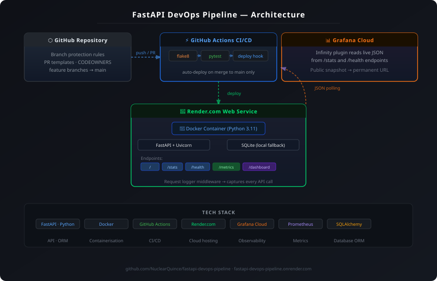
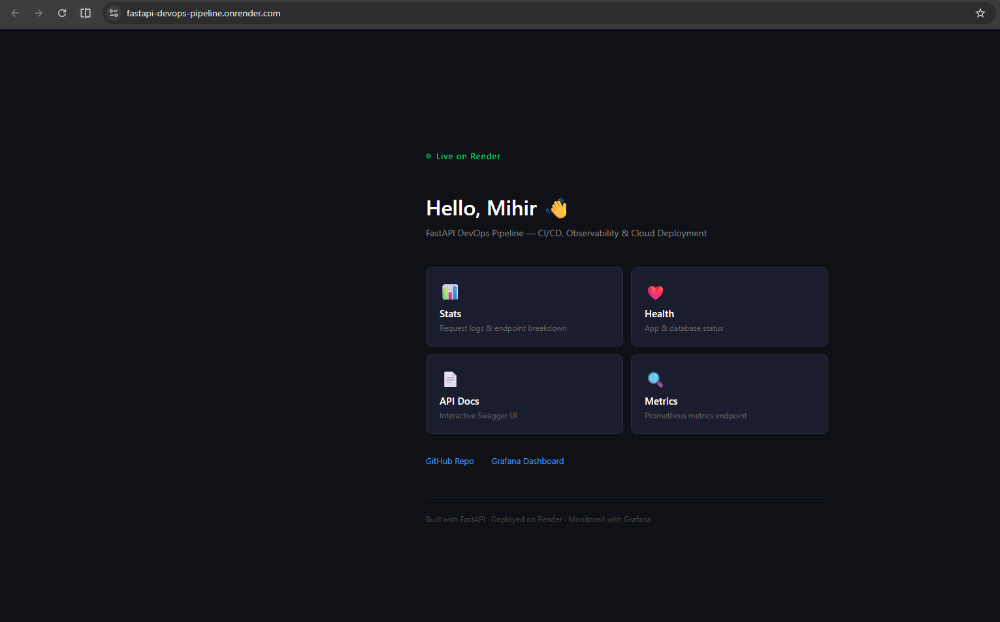
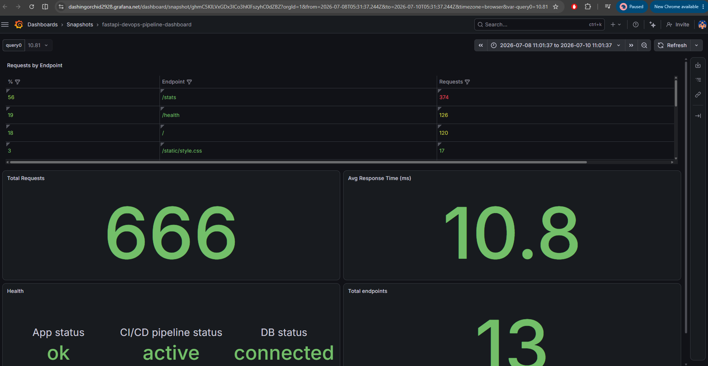

# FastAPI DevOps Pipeline

A production-grade Python API demonstrating end-to-end DevOps practices — CI/CD, containerisation, cloud deployment, and live observability. Every component is built and maintained using industry-standard tooling and workflows.

**🌐 Live URL:** https://fastapi-devops-pipeline.onrender.com
**📊 Grafana Dashboard:** https://dashingorchid2928.grafana.net/dashboard/snapshot/ghmC5KILVxGDx3ICo3hKlFszyhC0dZBZ
**💻 GitHub:** https://github.com/NuclearQuince/fastapi-devops-pipeline

---

## What This Project Does

A FastAPI application that logs every incoming HTTP request to a database and exposes
aggregate statistics via a `/stats` endpoint. The app is fully containerised, deployed
to a cloud platform, and monitored via a live Grafana dashboard — demonstrating a
complete DevOps workflow from code commit to production observability.

**Core features:**
- **Request logger** — middleware captures every API call (method, path, status code,
  response time) and persists it to a database
- **Stats API** — `/stats` returns total requests, average response time, and a
  per-endpoint breakdown with percentage share
- **Health checks** — `/health` reports app, database, and CI/CD pipeline status
- **Prometheus metrics** — `/metrics` exposes real-time app metrics via
  `prometheus-fastapi-instrumentator`
- **Live Grafana dashboard** — visualises request stats and health data using the
  Infinity plugin reading live JSON endpoints
- **12-factor config** — all configuration via environment variables, no hardcoded values

---

## Architecture



```
┌─────────────────────────────────────────────┐
│              GitHub Repository               │
│    Branch protection · PR templates          │
│    CODEOWNERS · feature branch workflow      │
└─────────────────┬───────────────────────────┘
                  │ push / pull request
                  ▼
┌─────────────────────────────────────────────┐
│          GitHub Actions CI/CD                │
│                                             │
│  flake8 ──► pytest ──► Deploy hook          │
│  (lint)    (tests)   (merge to main only)   │
└─────────────────┬───────────────────────────┘
                  │ auto-deploy on merge to main
                  ▼
┌─────────────────────────────────────────────┐
│         Render.com Web Service               │
│           (Docker container)                 │
│                                             │
│  FastAPI + Uvicorn  ←→  SQLite / PostgreSQL  │
│                                             │
│  / · /stats · /health · /metrics            │
│  /dashboard · /docs                         │
│                                             │
│  Request logger middleware                  │
│  (captures every API call → database)       │
└──────┬──────────────────────────────────────┘
       │ Infinity plugin reads /stats + /health
       ▼
┌─────────────────────────────────────────────┐
│              Grafana Cloud                   │
│  Live dashboard · Public snapshot URL        │
└─────────────────────────────────────────────┘
```

---

## CI/CD Pipeline

Every change is gated through an automated pipeline before reaching production:

```
Push to feature branch → Open Pull Request
         │
         ▼
  GitHub Actions (CI)
  ├── flake8 linting
  └── pytest (test suite)
         │
  ✅ Must pass to merge
         │
         ▼
  Merge to main
         │
         ▼
  GitHub Actions (CD)
  └── Render deploy hook triggered
         │
         ▼
  Render rebuilds Docker image
  and redeploys automatically
```

**Branch protection enforces:**
- No direct pushes to `main`
- All CI checks must pass before merging
- PR template used for every change

---

## Tech Stack

| Layer | Technology |
|---|---|
| API | FastAPI, Python 3.11, Uvicorn |
| Database | SQLite (local/fallback), PostgreSQL via SQLAlchemy ORM |
| Containerisation | Docker |
| CI/CD | GitHub Actions |
| Cloud Hosting | Render.com |
| Observability | Prometheus metrics, Grafana Cloud (Infinity plugin) |
| Code Quality | flake8, pytest |
| Config | Environment variables (12-factor app) |

---

## API Endpoints

| Endpoint | Method | Returns | Description |
|---|---|---|---|
| `/` | GET | HTML | Landing page with navigation |
| `/stats` | GET | JSON | Request statistics from database |
| `/health` | GET | JSON | App, database and CI/CD status |
| `/metrics` | GET | Text | Prometheus metrics |
| `/dashboard` | GET | Redirect | Redirects to Grafana dashboard |
| `/docs` | GET | HTML | Interactive Swagger UI |

### Example `/stats` response

```json
{
  "total_requests": 373,
  "avg_response_time_ms": 9.74,
  "endpoint_count": 6,
  "requests_by_endpoint": [
    { "path": "/stats", "count": 241, "percent": 64 },
    { "path": "/", "count": 49, "percent": 13 },
    { "path": "/health", "count": 48, "percent": 13 }
  ]
}
```

### Example `/health` response

```json
{
  "app_status": "ok",
  "db_status": "connected",
  "total_requests": 373,
  "metrics": "exposed at /metrics",
  "ci_cd": "active"
}
```

---

## Observability

The app exposes Prometheus metrics at `/metrics` via the
`prometheus-fastapi-instrumentator` library, including:

- `http_requests_total` — request count by method, path, and status code
- `http_request_duration_seconds` — request latency histogram
- `process_resident_memory_bytes` — memory usage
- `process_cpu_seconds_total` — CPU usage

These are visualised in a Grafana Cloud dashboard using the Infinity plugin, which
polls live JSON data from the `/stats` and `/health` endpoints in real time.

> **Note:** The Grafana dashboard link points to a public snapshot taken during active
> monitoring. The `/metrics` endpoint continues to expose real-time Prometheus data
> from the running application.

---

## Local Development

**Prerequisites:** Python 3.11+, Docker

```bash
# Clone the repo
git clone https://github.com/NuclearQuince/fastapi-devops-pipeline.git
cd fastapi-devops-pipeline

# Create and activate virtual environment
python -m venv venv
source venv/bin/activate        # Mac/Linux
venv\Scripts\Activate.ps1       # Windows PowerShell

# Install dependencies
pip install -r requirements.txt

# Run locally — uses SQLite by default, no database setup needed
uvicorn app.main:app --reload
```

Visit http://localhost:8000 to see the landing page.

**Run the test suite:**

```bash
pytest tests/ -v
flake8 app/ tests/ --max-line-length=100
```

**Run with Docker:**

```bash
docker build -t fastapi-devops-pipeline:latest .
docker run -p 8000:8000 fastapi-devops-pipeline:latest
```

---

## Environment Variables

| Variable | Description | Default |
|---|---|---|
| `DATABASE_URL` | Database connection string | `sqlite:///./local.db` |
| `APP_OWNER_NAME` | Name displayed on landing page | `World` |

The app defaults to SQLite locally and connects to PostgreSQL in production via
`DATABASE_URL` — following 12-factor app principles where config lives in the
environment, not the code.

---

## Project Structure

```
fastapi-devops-pipeline/
├── app/
│   ├── main.py          # FastAPI app, routes, middleware
│   ├── database.py      # SQLAlchemy engine and session management
│   ├── models.py        # RequestLog ORM model
│   └── __init__.py
├── tests/
│   ├── test_main.py     # pytest test suite
│   └── __init__.py
├── static/
│   └── style.css        # Landing page styles
├── templates/
│   └── index.html       # Landing page (Jinja2)
├── docs/
│   └── architecture.svg # Architecture diagram
├── .github/
│   ├── workflows/
│   │   └── ci.yml       # GitHub Actions — lint, test, deploy
│   ├── pull_request_template.md
│   └── CODEOWNERS
├── Dockerfile
├── requirements.txt
└── README.md
```

---

## Key DevOps Concepts Demonstrated

| Concept | Implementation |
|---|---|
| CI/CD | GitHub Actions — lint, test, deploy pipeline |
| Containerisation | Dockerised app, configurable via environment |
| GitOps workflow | Branch protection, PR reviews, status checks |
| Observability | Prometheus metrics + Grafana Cloud dashboard |
| Health monitoring | `/health` endpoint reporting system component status |
| 12-factor app | Config via env vars, stateless processes, attached backing services |
| Cloud deployment | Render.com with managed database |
| Infrastructure as config | No hardcoded values, environment-driven config |

---

## Screenshots

### Landing Page


### Grafana Dashboard


---

## Author

**Mihir Salian** — Cloud Operations & SRE
[LinkedIn](https://www.linkedin.com/in/mihir-salian-760635198/) ·
[GitHub](https://github.com/NuclearQuince)
